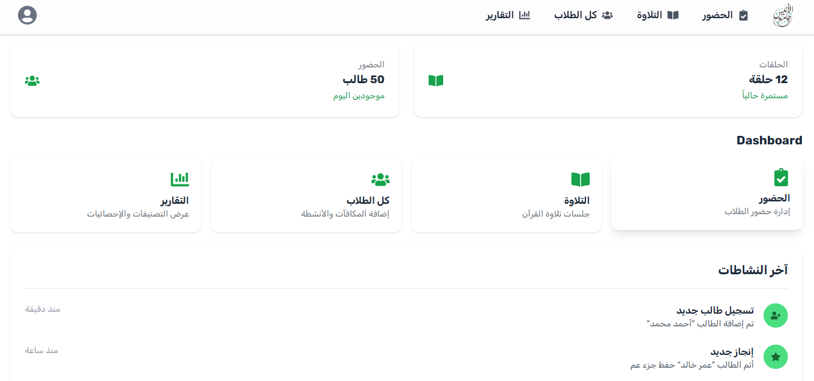

# 🎓 AL-ANIS — Educational Tracking & Student Management Platform

> An interactive web application built for managing student rosters, tracking daily attendance, evaluating performance, and generating real-time leaderboards.

---

## 📸 Screenshots


*Student tracking dashboard and performance evaluation interface.*

---

## ✨ Key Features

* **Student Roster Management:** Easily add, edit, and categorize students by groups or classes.
* **Attendance & Progress Tracking:** Record daily attendance and monitor memorization and study progress.
* **Dynamic Point System:** Add or deduct performance points in real-time with instant state updates.
* **Automated Leaderboard:** Auto-calculates top performers and generates dynamic ranking list for students.

---

## 🛠️ Tech Stack

* **Frontend:** React.js, TypeScript
* **Styling:** Tailwind CSS
* **Icons & UI:** Lucide React
* **Version Control:** Git, GitHub

---

## 🚀 Getting Started Locally

To run this project locally on your machine:

1. **Clone the repository:**
   ```bash
   git clone [https://github.com/allahhamomar117-hue/AL-ANIS.git](https://github.com/allahhamomar117-hue/AL-ANIS.git)